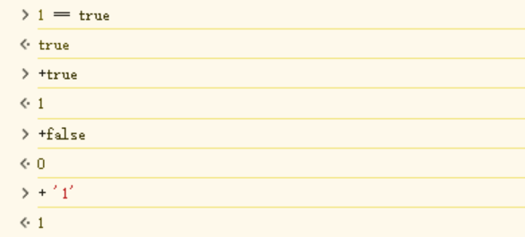
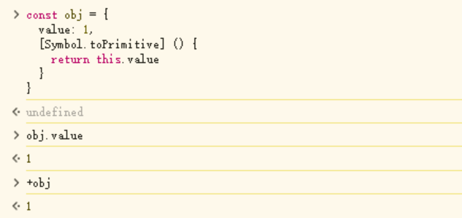
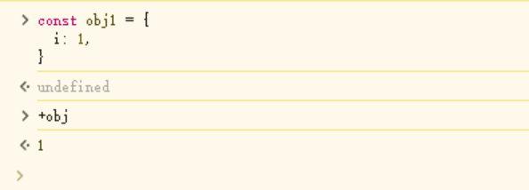
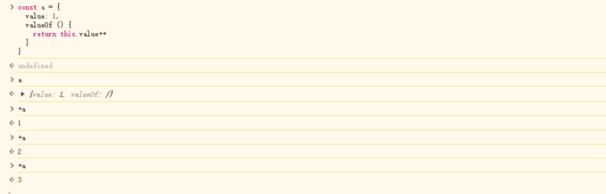

---
categories:
- JavaScript
title: JavaScript中的双等号问题
tags:
- 双等号
- 原始对象转化
date: 2024-07-17 21:00:00
---


# 相等和对象的原始转换

## 导语

近期在进行`JavaScript`的基础复习时，发现这么一道面试题：

```
/** 请让下面的等式成立*/
if (a == 1 && a == 2 && a == 3) {
	console.log('Hello word!')
}
```

这里面涉及到`==`的隐式转换和对象的原始转化问题。

## 相等的转化规则

从上到下按照规则比较，直到能得到确切结果为止：

- 两端都存在`NaN`，返回`false`；

- `undefined`和`null`只有与自身比较或者相互比较时，才会返回`true`；

- 两端类型相同，比较值；

- 两端都是原始类型，转换为数字重新比较；

- 一端为原始类型，一端是对象类型，把对象转化为原始类型重新比较。

  ```javascript
  NaN == NaN  // false
  null == undefined // true
  null == null // true
  undefined == undefined // true
  ```

  两端都是原始类型的转化

  

  

## 对象转原始类型

对象转原始类型，按照从上到下的规则进行转化：

- 如果对象拥有`[Symbol.toPrimitive]`方式时，调用该方法，若能得到原始值，则使用该原始值，否则抛出异常；

- 调用对象的`valueOf`方法，如果得到原始值，使用该原始值，否则进入下一步；

- 调用对象的`toString`方法，如果得到原始值，使用该原始值，否则抛出异常。

  



## 结论

想要实现最刚开始的等式成立，可以使用下面的方式：

```javascript
const a = {
	value: 1,
	valueOf () {
		rerurn this.value++
	}
}
```



这样每次调用的时都会调用`valueOf`，这样转化出来的值就成立。
