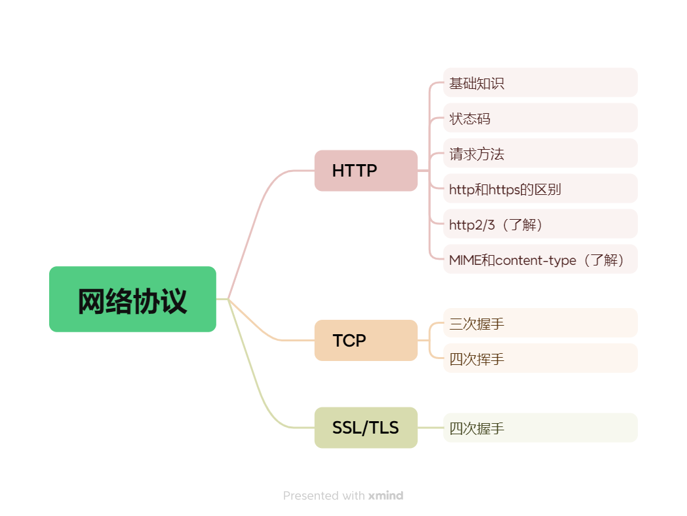
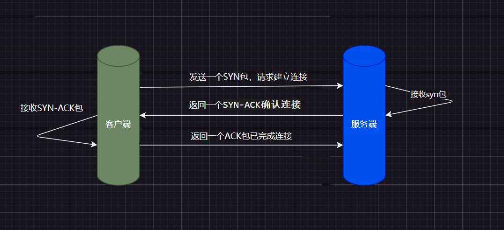
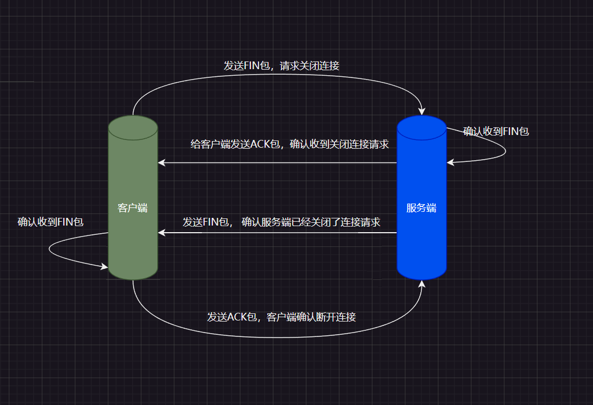
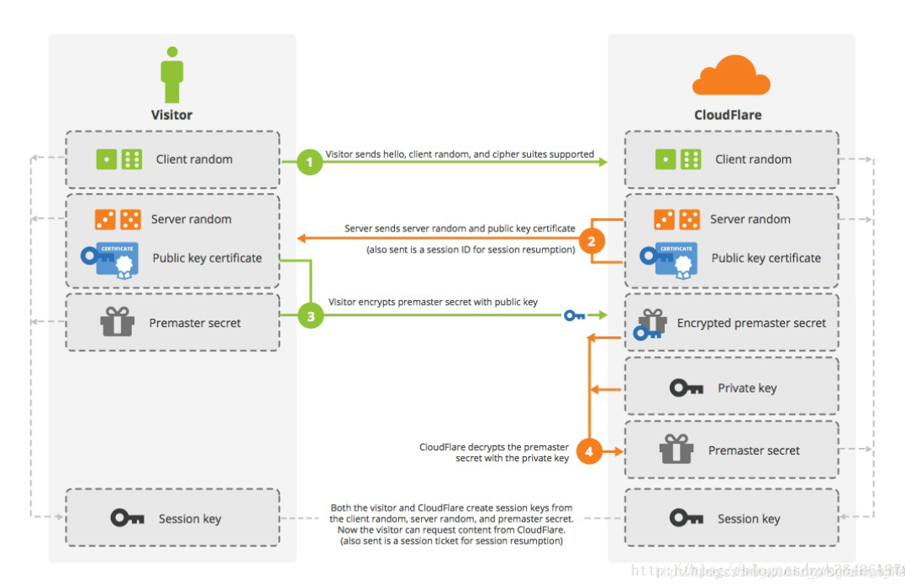

## 前言
  最近在面试中，面试官总是会问到网络协议这块，但是每次都回答的不是很清楚，所以下来整理梳理下这块的知识。其实这块的知识整体也没多少。
  

## 一、HTTP
### 1.1 基础知识
  1. http是什么？ 
    :star2: http是超文本传输协议(HyperText Transfer Protocol)。
  2. http协议的作用是什么？ 
    :star2: http协议是用于确保客户端与服务器之间的通信。
    :star2: http设计的目的是为了提供一种发布和接收 HTML 页面的方法。
    :star2: 它是基于TCP/IP通信协议来传递数据（HTML 文件, 图片文件, 查询结果等）。
  3. http的安全问题？ 
    :star2: http协议是无状态的，每次请求都是独立的，服务器不会保存客户端的状态，且传输的数据未经加密，可能会被窃听或篡改。
### 1.2 http的状态码？
  1. 1xx（信息性状态码） 
  2. 2xx（成功状态码） 
  3. 3xx（重定向状态码） 
  4. 4xx（客户端错误状态码） 
  5. 5xx（服务器错误状态码） 

| 状态码 | 描述 | 记忆 |
| :----- | :---------- | :----: |
| 100 | 继续。客户端应继续其请求 | :white_check_mark: |
| 101 | 切换协议。服务器根据客户端的请求切换协议。 | :negative_squared_cross_mark: |
| 200 | 成功。请求成功。一般用于 GET 和 POST 请求 | :white_check_mark: |
| 201 | 已创建。成功请求并创建了新的资源 | :negative_squared_cross_mark: |
| 202 | 已接受。已经接受请求，但未处理完成 | :negative_squared_cross_mark: |
| 203 | 非授权信息。请求成功。但返回的元信息不在原始的服务器，而是一个副本 | :negative_squared_cross_mark: |
| 204 | 无内容。服务器成功处理，但未返回内容。在未更新网页的情况下，可确保浏览器继续显示当前文档 | :negative_squared_cross_mark: |
| 205 | 重置内容。服务器处理成功，用户终端（例如：浏览器）应重置文档视图。此响应主要是用于清除浏览器的表单域 | :negative_squared_cross_mark: |
| 206 | 部分内容。服务器成功处理了部分 GET 请求 | :negative_squared_cross_mark: |
| 300 | 多种选择。请求的资源可包括多个位置，相应可返回一个资源特征与地址的列表用于用户终端（例如：浏览器）选择 | :negative_squared_cross_mark: |
| 301 | 永久移动。请求的资源已被永久移动到新位置。服务器返回此响应（对 GET 或 HEAD 请求的响应）时，会自动将请求者转到新位置。 | :negative_squared_cross_mark: |
| 302 | 临时移动。请求的资源临时从不同的 URI 响应请求。由于这样的重定向是临时的，客户端应当继续向原有地址发送以后的请求。 | :negative_squared_cross_mark: |
| 303 | 查看其他位置。请求的资源可在另一个 URI 下被找到，应使用 GET 请求访问那个资源。 | :negative_squared_cross_mark: |
| 304 | 未修改。自从上次请求后，请求的网页未修改过。服务器返回此响应时，不会返回网页内容。 | :white_check_mark: |
| 305 | 使用代理。请求的资源必须通过代理访问 | :negative_squared_cross_mark: |
| 307 | 临时重定向。与 302 相似。使用 GET 请求重定向 | :negative_squared_cross_mark: |
| 400 | 请求错误。服务器无法理解请求的格式，客户端不应当尝试再次使用相同的内容发起请求 | :white_check_mark:|
| 401 | 未授权。请求要求身份验证。对于需要登录的网页，服务器可能返回此响应 | :white_check_mark: |
| 403 | 禁止。服务器拒绝请求 | :white_check_mark: |
| 404 | 未找到。服务器找不到请求的资源 | :white_check_mark: |
| 405 | 方法禁用。请求中指定的请求方法不能用于请求相应的资源 | :negative_squared_cross_mark: |
| 406 | 不接受。无法使用请求的内容特性响应请求的网页 | :negative_squared_cross_mark: |
| 407 | 需要代理授权。该状态码与 401（未授权）类似，但指定请求者应当授权使用代理。|  :negative_squared_cross_mark: |
| 408 | 请求超时。服务器等候请求时发生超时 | :negative_squared_cross_mark: |
| 409 | 冲突。由于冲突，请求无法完成 | :negative_squared_cross_mark: |
| 410 | 已删除。如果请求的资源已永久删除，服务器就会返回此响应 | :negative_squared_cross_mark: |
| 411 | 需要有效长度。服务器不接受不含有效内容长度标头字段的请求 | :negative_squared_cross_mark: |
| 412 | 未满足前提条件。服务器未满足请求者在请求中设置的其中一个前提条件 | :negative_squared_cross_mark: |
| 413 | 请求实体过大。请求实体过大，服务器无法处理 | :negative_squared_cross_mark: |
| 414 | 请求的 URI 过长。请求的 URI 过长（URI 通常为网址），服务器无法处理 | :negative_squared_cross_mark: |
| 415 | 不支持的媒体类型。请求的格式不受请求页面的支持 | :negative_squared_cross_mark: |
| 416 | 请求范围不符合要求。如果页面无法提供请求的范围，则服务器会返回此状态码 | :negative_squared_cross_mark: |
| 417 | 未满足期望值。服务器未满足"期望"请求标头字段的要求 | :negative_squared_cross_mark: |
| 500 | 服务器内部错误。服务器遇到错误，无法完成请求 | :white_check_mark: |
| 501 | 服务器不支持请求的功能。服务器不支持请求的功能，无法完成请求 | :negative_squared_cross_mark: |
| 502 | 错误网关。服务器作为网关或代理，从上游服务器收到无效响应 | :negative_squared_cross_mark: |
| 503 | 服务不可用。服务器目前无法使用（由于超载或停机维护） | :white_check_mark: |
| 504 | 网关超时。服务器作为网关或代理，但是没有及时从上游服务器收到请求 | :white_check_mark: |
| 505 | HTTP 版本不受支持。服务器不支持请求中所使用的 HTTP 协议版本 | :white_check_mark: |

上述中得状态码，我们只需要关注100、200、304、401、402、403、404、500、503、504、505 这几个状态码即可。
### 1.3 请求方法
| 方法 | 描述 |
| --- | --- |
| GET | 请求指定的页面信息，并返回实体主体 |
| POST | 向指定资源提交数据进行处理请求（例如提交表单或者上传文件）。数据被包含在请求体中。POST 请求可能会导致新的资源的建立和/或已有资源的修改 |
| PUT | 从客户端向服务器传送的数据取代指定的文档的内容 |
| DELETE | 请求服务器删除指定的页面 |
| CONNECT | HTTP/1.1 协议中预留给能够将连接改为管道方式的代理服务器 |
| OPTIONS | 允许客户端查看服务器的性能 |

### 1.4 https
  :star2: https: 超文本传输安全协议(HyperText Transfer Protocol Secure)，即http的安全版本，在http的基础上加入了SSL(Secure Sockets Layer)协议，用于对传输的数据进行加密。
### 1.5 https与http的区别

| 区别 | http | https |
| :---: | :---: | :---: |
| 加密 | 不加密，容易被篡改和截获 | 加密，使用SSL/TLS协议对传输的数据进行加密 |
| 端口 | 80 | 443 |
| 证书 | 不需要 | 需要申请SSL证书 |
| 成本 | 免费 | 需要购买证书费，有一定成本 |
| seo | 搜索引擎可能会对没有使用HTTPS的网站进行降权 | 搜索引擎倾向于优先索引和展示使用HTTPS的网站 |
| 安全性 | 不安全，且浏览器会进行提示显示不安全网站 | 安全，浏览器显示一个锁形图标，表示网站是安全的 |
| 性能 | 不加密数据，性能高于https | 需要加密和解密数据，有一定的性能损耗 |
| 兼容性 | 兼容性好 | 部分老浏览器不支持 |
| 运用场景 | 不需要传输敏感数据， 如博客、新闻网站等 | 需要传输敏感数据，如银行、电商网站、电子邮件等 |

### 1.6 http2/3
  :star2: http2: http2是http协议的第二个主要版本，是1.1版本的升级， 基于SPDY协议开发的，大部分浏览器在2015年左右支持，主要是为了解决http1.1的性能、延迟、安全问题。

  **http2的改进：**
  1. 多路复用：HTTP/2 允许同时发送多个请求和响应，而不是像 HTTP/1.1 一样只能一个一个地处理。这样可以减少延迟，提高效率，提高网络吞吐量。
  2. 二进制传输：HTTP/2 使用二进制协议，与 HTTP/1.1 使用的文本协议不同。二进制协议可以更快地解析，更有效地传输数据，减少了传输过程中的开销和延迟。
  3. 头部压缩：HTTP/2 使用 HPACK 算法对 HTTP 头部进行压缩，减少了头部传输的数据量，从而减少了网络延迟。
  4. 服务器推送：HTTP/2 支持服务器推送，允许服务器在客户端请求之前推送资源，以提高性能。
  5. 改进的安全性：HTTP/2 默认使用 TLS（Transport Layer Security）加密传输数据，提高了安全性。
  6. 兼容 HTTP/1.1：HTTP/2 可以与 HTTP/1.1 共存，服务器可以同时支持 HTTP/1.1 和 HTTP/2。如果客户端不支持 HTTP/2，服务器可以回退到 HTTP/1.1

  :star2: http3: http3是http协议的第三个主要版本，是http2的升级，基于QUIC协议开发的，大部分浏览器在2020年左右支持，主要是为了解决http2的中使用TCP和SSL双连接的局限性。

  **http3的改进：**

  1. **消除队头阻塞（Head-of-Line Blocking）：** HTTP/2 因使用 TCP 而存在队头阻塞问题，当一个数据包延迟时，会阻塞整个数据流。HTTP/3 通过使用基于 UDP（用户数据报协议）的新传输协议 QUIC 解决了这个问题。在 HTTP/3 中，如果一个数据包丢失，只有受影响的流会暂停，其他流可以继续传输，大大提高了数据传输效率。
  2. **更快的连接建立：** HTTP/3 通过使用 QUIC 的内置功能，将传输握手和加密握手合二为一，从而减少了延迟。与需要多次握手的 HTTP/2 相比，HTTP/3 的连接建立速度更快。
  3. **增强的安全性：** HTTP/3 在传输层默认要求加密，而 HTTP/2 的加密是可选的。这种默认加密确保了更安全的浏览体验。
  4. **在移动和网络切换场景中的更好表现：** QUIC 设计能够更高效地处理网络切换，使HTTP/3 在用户频繁切换Wi-Fi和移动网络时更加可靠。

### 1.7 content-type
  Content-Type（内容类型），一般是指网页中存在的 Content-Type，用于定义网络文件的类型和网页的编码，决定浏览器将以什么形式、什么编码读取这个文件。
  :::info 参考
  了解更多，请参考菜鸟网站
  [Content-Type](https://www.runoob.com/http/http-content-type.html)
  :::

### 1.8 MIME类型
MIME (Multipurpose Internet Mail Extensions) 是描述消息内容类型的标准，用来表示文档、文件或字节流的性质和格式。

MIME 消息能包含文本、图像、音频、视频以及其他应用程序专用的数据。

浏览器通常使用 MIME 类型（而不是文件扩展名）来确定如何处理URL，因此 We b服务器在响应头中添加正确的 MIME 类型非常重要。如果配置不正确，浏览器可能会无法解析文件内容，网站将无法正常工作，并且下载的文件也会被错误处。

:::info 参考
  了解更多，请参考菜鸟网站
  [MIME类型](https://www.runoob.com/http/mime-types.html)
:::

## 二、TCP/IP协议

TCP/IP协议是互联网的基础协议，由传输层协议TCP和IP协议组成。TCP/IP协议用于在计算机之间传输数据，确保数据传输的可靠性和完整性。

这里主要讲下关于TCP的三次握手和四次挥手，至于其他基础知识，请自行查阅。

### 2.1 三次握手

三次握手是TCP协议建立连接的过程，它确保了双方都准备好进行数据传输。

三次握手的过程如下：

1. **SYN（同步）**：客户端向服务器发送一个SYN包，请求建立连接。这个包中包含一个初始序列号。
2. **SYN-ACK（同步-确认）**：服务器收到SYN包后，向客户端发送一个SYN-ACK包，表示同意建立连接。这个包中包含一个确认号，确认号是客户端的初始序列号加1。
3. **ACK（确认）**：客户端收到SYN-ACK包后，向服务器发送一个ACK包，表示确认连接已经建立。这个包中包含一个确认号，确认号是服务器的初始序列号加1。

通过三次握手，客户端和服务器都确认了对方的接收和发送能力，从而建立了可靠的连接。

### 2.2 四次挥手

四次挥手是TCP协议关闭连接的过程，它确保了双方都准备好结束数据传输。

四次挥手的过程如下：

1. **FIN（终止）**：客户端向服务器发送一个FIN包，表示请求关闭连接。
2. **ACK（确认）**：服务器收到FIN包后，向客户端发送一个ACK包，表示确认收到关闭请求。
3. **FIN（终止）**：服务器向客户端发送一个FIN包，表示请求关闭连接。
4. **ACK（确认）**：客户端收到FIN包后，向服务器发送一个ACK包，表示确认收到关闭请求。

通过四次挥手，客户端和服务器都确认了对方的关闭请求，从而结束了连接。

:::tip 场景模拟理解
  张学友叫刘德华帮忙参演他的演唱会
  三次握手
  1. 张学友：刘德华，我需要你参演我的演唱会，你能来吗？
  2. 刘德华：好的，我收到你的请求，我确认我可以来。
  3. 张学友：好的，我确认你来了，我们开始排练吧。

  四次挥手
  1. 张学友：现在演唱会结束了，感谢你来参加我的演唱会，现在可以去忙你的事情了。
  2. 刘德华：好的，我收到你的请求，我确认我离开。
  3. 刘德华：我离开后，我需要你确认我离开。
  4. 张学友：好的，我确认你离开。
:::

## 三、SSL/TLS

SSL（Secure Sockets Layer）和TLS（Transport Layer Security）是用于加密网络通信的协议，它们可以保护数据在传输过程中的安全性和完整性。

SSL和TLS的主要功能包括：

1. **加密数据**：SSL和TLS使用加密算法对数据进行加密，确保数据在传输过程中的安全性。
2. **验证身份**：SSL和TLS使用数字证书验证通信双方的身份，确保通信的双方是可信的。
3. **完整性保护**：SSL和TLS使用哈希算法对数据进行完整性保护，确保数据在传输过程中没有被篡改。
4. **防止重放攻击**：SSL和TLS使用时间戳和序列号防止重放攻击，确保数据不会被重复发送。

SSL和TLS的主要区别在于版本和实现。SSL是最早的加密协议，而TLS是SSL的后续版本，提供了更强大的加密算法和更好的安全性。目前，TLS已经成为主流的加密协议，SSL已经被逐渐淘汰。

### 3.1 SSL/TLS握手

SSL/TLS握手是SSL/TLS协议建立安全连接的过程。

握手过程包括以下步骤：

1. **客户端发送ClientHello消息**：客户端向服务器发送ClientHello消息，包括客户端支持的SSL/TLS版本、加密算法、压缩方法等信息， 生成一个加密信息发送(Client random)。
2. **服务器发送ServerHello消息**：服务器收到ClientHello消息后，选择一个双方都支持的SSL/TLS版本、加密算法、压缩方法等信息，并向客户端发送ServerHello消息，并且服务器向客户端发送自己的数字证书，证明服务器的身份，且生成一个加密信息发送(Server random)。
3. **客户端回应**：客户端验证服务器的数字证书是否有效，如果证书无效，则握手失败，并且这里会生成一个加密信息(Premaster secret), 根据加密算法生成(Session Key), 并且回执给服务端。
4. **服务端回应**：接收到客户端的(Premaster secret)， 根据加密算法生成和客户端一样的(Session Key)。

## 结语
以上就是关于网络协议这块在面试题中问的比较多的东西，如果需要获取更多知识，需要对这块进行深入学习，这里面涉及还是有蛮多东西的。一般这里的知识能应付大部分面试了。