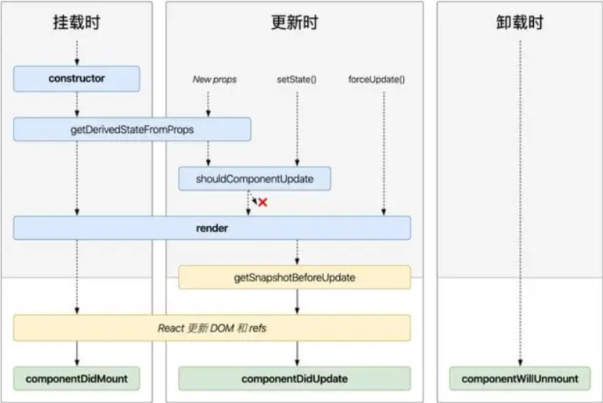
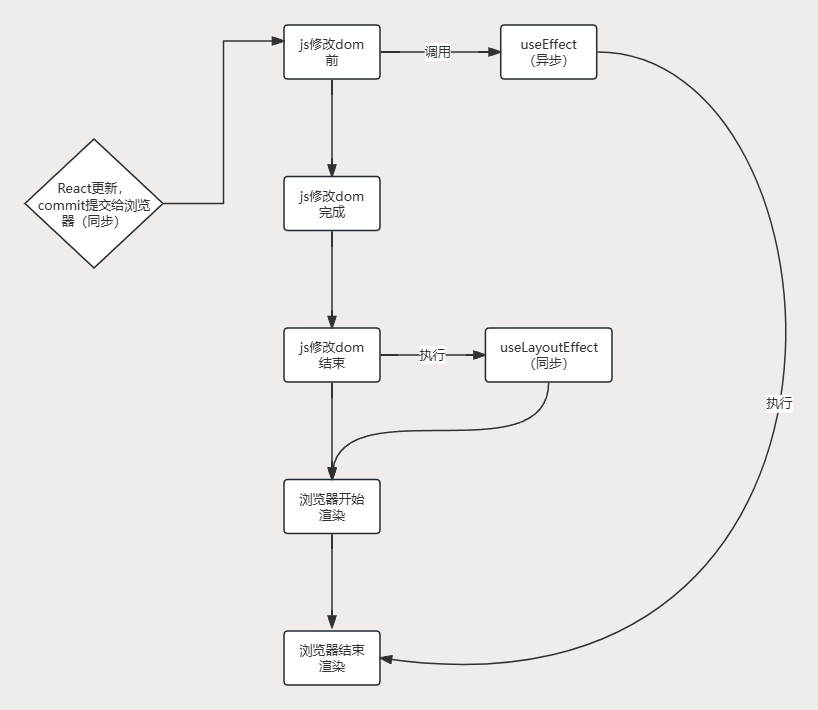

[[toc]]

## 1. React和ReactDom两个包分别有什么作用？
1. react: 这是React库的核心， 它定义了React组件的创建和生命周期方法，以及React元素概念。可以视作React的“引擎”。
2. react-dom: 这个库提供了在浏览器环境中使用React的方法， 例如将React组件渲染到DOM中，或者在DOM中触发React组件的更新。可以将其视为React的“驱动程序"
3. react-dom/client 是浏览器渲染用的库， 同理node端也有对应的库。

## 2. React为什么有多个包？ React是框架吗？
1. 为了功能解耦，渲染有渲染的专用包， 引擎就只负责引擎
2. React的核心， 其实就是一个渲染的库。

## 2. React组件的渲染过程是怎样的？
1. 组件的渲染过程分为两个阶段：
    1. 挂载阶段（Mounting）：将组件渲染为DOM元素，并将其插入到页面中。
    2. 更新阶段（Updating）：当组件的state或props发生变化时，React会重新渲染组件，并更新DOM元素以反映新的状态或属性。
2. 组件的渲染过程涉及以下步骤：
    1. 调用组件的render方法，生成虚拟DOM。
    2. 将虚拟DOM转换为真实的DOM元素，并插入到页面中。
    3. 当组件的state或props发生变化时，React会重新调用render方法，生成新的虚拟DOM。
    4. 将新的虚拟DOM与原始的虚拟DOM进行比较，确定需要更新的部分。
    5. 更新需要更新的DOM元素，以反映新的状态或属性。

## 3. React中的虚拟DOM是什么，它的作用是什么或者优点？
1. 虚拟DOM是一种用于描述真实DOM的JavaScript对象。
2. 虚拟DOM可以用于描述DOM的结构、属性、样式等，并且可以进行高效的比较和更新。
3. 虚拟DOM可以提高性能和效率，减少对真实DOM的频繁操作。
4. 跨平台

## 4. 严格模式的作用？
1. 不安全的生命周期方法： 某些生命周期方法在未来的React版本中将被弃用。 严格模式会告警这些不安全方法的使用。
2. 使用过时或遗留的API：严格模式会警告使用过时或遗留的API。
3. 意外的副作用： 严格模式可以帮助你发现组件中可能的意外副作用。
4. 与旧版本React不兼容的代码： 严格模式会警告你的代码中可能与未来版本的React不兼容的部分。

## 5. *JSX*的作用？
1. 可以在js中返回dom，经过babel编译成js认识的代码。
2. 接收两个参数：第一个参数：标签名；第二个参数：子元素以及标签上的一些属性。
3. 使用_jsx方法进行编译， 这个是来自react底层`react/jsx-runtime`。
> [babel.j在线网址](https://babeljs.io/)

## 6. React中的生命周期方法有哪些？它们的作用是什么？
1. 组件的挂载阶段（Mounting）：
    1. constructor：用于初始化组件的state和其他属性。
    2. getDerivedStateFromProps：一个静态方法，接收props和state，可以用于执行一些逻辑返回一个对象更新state，返回值为null时，不更新state，在render之前执行。
    3. render：初始化渲染页面。
    4. componentDidMount：在组件挂载到DOM之后执行，可以用于执行一些副作用操作，例如获取DOM元素或发起网络请求。
2. 组件的更新阶段（Updating）：
    1. getDerivedStateFromProps：在组件接收到新的props进行调用。
    2. shouldComponentUpdate：在组件接收到新的props或state之前执行，用于确定是否需要重新渲染组件，作为组件性能优化出现，使用forceUpdate不会触发该钩子。
    3. render：执行render重新渲染页面。
    4. getSnapshotBeforeUpdate：在组件更新之前执行，可以用于执行一些副作用操作，例如获取DOM元素或保存一些数据。
    5. componentDidUpdate：在组件重新渲染并更新到DOM之后执行，可以用于执行一些副作用操作，例如根据新的props或state更新state。
3. 组件的卸载阶段（Unmounting）：
    1. componentWillUnmount：在组件卸载之前执行，可以用于执行一些副作用操作，例如清除定时器或取消网络请求。
    

## 7. getDerivedStateFromProps的作用是什么？
它的返回值，会对state进行相同属性覆盖修改， 如果没有和state属性相同的就不做修改。
1. **执行时机**：挂载和更新都会更新，在render之前。
2. **使用场景：** 进行某些值进行转化（列如后端返回数字状态，前端使用中文显示）。
3. **注意事项：** 不要在getDerivedStateFromProps中使用setState，否则会死循环。

## 8. getSnapshotBeforeUpdate的特点？
1. **执行时机：** 只会在更新的时候执行，在render之后，浏览器页面更新之前。
2. **作用：** 返回值可以传递给componentDidUpdate。
3. **使用场景：** 长列表，需要不断往里面塞入内容。更新之前，记录滚动的位置，传递给`componentDidUpdate`保持滚轮的位置。 `getSnapshotBeforeUpdate`更新之前记录滚轮的原始位置，并将原始位置通过`return`给`componentDidUpdate`。`componentDidUpdate`就使用原始的位置更新DOM，保证滚轮不会变化。

## 9. React是MVVM框架嘛？
1. React不是一个典型的MVVM(Model-View-ViewModel)框架，它更倾向于是一个V(View)层库。尽管React可以与其他库(如Redux或Mobx)结合使用以实现丰富的架构，但它本身并没有提供严格的ViewModel层。
2. 在MVVM模式中，ViewModel作为连接视图(View)和数据(Model)的桥梁的中间层， 负责管理视图的状态和数据，并与数据模型进行交互。而React的设计理念更加集中在组件化的 视图层，通过构建可重用的组件来管理UI状态。
3. React强调的是单向数据流的概念， 其中数据从父组件通过props传递给子组件，子组件通过回调函数将状态更改传递回父组件。这种单项数据流的模型有助于构建可预测可维护的组件，但是与典型的双向绑定的MVVM模式不同。

## 10. React如何实现MVVM？
在React中，可以使用以下方法来实现类似的MVVM的架构：
1. **使用状态管理库：** React可以与状态管理库(如Redux、Mobx和React Context)结合使用，以实现集中化的状态管理。这些库可以帮助在模型层和视图层之间进行数据传递和状态管理，从而实现MVVM的一部分。
2. **使用双向数据绑定库：** 第三方库(如mobx-react-lite、reactive-react等)提供了双数数据绑定的能力，它们可以使React组件中的数据与视图保持同步。通过使用这些库，你可以更接近MVVM模式中的双向数据绑定概念。
3. **自定义视图模型：** 在React中可以定义自己的视图模型或者对象， 将数据逻辑和转换逻辑封装到这些视图模型中。 通过将视图模型与React组件结合使用， 你可以实现数据的映射和处理逻辑。
:::tip
React本身是一个非常灵活的库，你可以选择与其他库或者模式结合使用，以满足你的应用程序需求。MVVM只是一种软件设计架构模式，具体实现方式可以根据项目特定要求和团队偏好进行调整。
:::

## 11. React的useState是做什么的？ 它是同步更新吗？
1. 用来声明组件中的变量的， 会返回当前的state和一个set函数， set函数用于触发更新state的。
2. setState的更新是异步的，React会进行批量操作合并更新。

## 12. React的性能优化Hooks有那些？分别有什么作用？
1. **useMemo:**  
    1. useMemo是用来缓存计算结果的。用于缓存计算量过大的函数，避免每次渲染都重新计算。
    2. 适用于当父组件更新时，子组件的重新render计算量比较大，且结果可以复用时，就可以使用useMemo来提升父组件渲染而引起的子组件不必要渲染的性能提升手段。
:::warning 注意事项
  useMemo在项目中一定是不得已才使用(明显出现了问题)。
  1. useMemo本身有性能消耗，缓存消耗内存，useMemo自身状态的维护也是有性能开销的。
  2. useMemo会增加开发成本，代码变得很复杂，不好维护。
  3. React官方在未来会移除useMemo这个Hook，因为useMemo本身存在一些问题，比如它不能保证缓存结果一定是最新的，因为React的渲染是异步的，所以useMemo的缓存结果可能会被旧的props或state覆盖。 
:::
2. **useCallback:**  
    1. useCallback是用来缓存函数的，避免每次渲染都重新创建函数，从而重新渲染子组件。

## 13. React中做组件渲染性能提升怎么做？ React渲染规律？
1. 使用`memo`这个API进行组件包裹，生成一个缓存组件， 如果它的props没有发生变化，那么组件就不会重新render。
2. **渲染规律:** 只要父组件进行了`setState`,父组件本身会重新render，所有子组件也会重新render。也就是所谓得全局更新。
:::tip 温馨提示
1. 如果要进行子组件渲染优化，那么useMemo和useCallback必须搭配memo使用，否则没有效果。
2. 如果子组件没有依赖父组件的props且子组件结构简单，那么子组件就不需要使用memo进行包裹，否则会造成性能浪费。
:::

## 14.  React的更新是同步还是异步？ 为什么？
1. 更新是异步的。
2. 因为React的更新底层的（微任务）异步队列，会将短时间js对组件的修改进行合并，1次完成渲染。

## 15. useEffect和useLayoutEffect的区别是什么？

1. 从上图就可以看出， 在js修改dom前会调用`useEffect`， 会在单独开辟一个任务队列来执行`useEffect`, 这样它就不会阻塞浏览器的渲染；而`useLayoutEffect`则是在dom修改结束后，浏览器开始渲染前执行，这样就会导致出现阻塞浏览器渲染。
2. **useLayoutEffect** 的应用场景：在处理一些js动画时， 可以使用它来提前把动画位置确认，这样就避免在一定情况下出现闪烁或者跳动的问题。

## 16. forwardRef的作用？
1. 实际上函数式组件没有ref的。
2. 我们想获取函数式组件内部的某个dom的实例，那么就可以使用forwardRef转发出去。

## 17. useContext的作用？
1. 主要用于跨组件通信。
2. 核心是父组件使用`Provider`包裹，给所有的子组件注入上下文。
3. 子孙组件可以使用`useContext`拿到顶层组件注入的值。
4. 一般修改状态，可以把状态和修改函数一起注入。

## 18. React的并发更新是什么？
1. fiber框架， 分片更新 => 异步更新
2. 组件渲染过程，实际上是js的执行，因为js执行不可中断，所以导致如果一个组件特别消耗js，就会卡住渲染。
3. fiber架构 => 数据机构(深度优先遍历) => 细粒度的拆分任务
  - 三个属性： child parent sibling
  - 浏览器的空闲时间：requestIdleCallback
::: tip
requestIdleCallback兼容性不好，React目前使用PostMessage模拟实现的，它是宏任务的异步。
:::

## 19. useTransition 和 useDeferredValue的区别是什么？
1. 解决的问题是一样的。
2. 只是应用场景有点细微的区别。
3. 一般`useDeferredValue`比较适合用于组件接收的`Props`参数导致的渲染缓慢优化。
4. `useTransition`适用于组件内部本身的性能优化。

## 20. React的hook一定要写在顶层作用域吗？
不是，比如use这个hook，这是一个特殊的存在。

## 21. useDebugValue的作用？
可以使用调试工具，做组件基本的`debug`, 记得开启严格模式。

## 22. 单页面和多页面的区别是什么？
1. **单页面：** 只有一个html页面
2. **多页面：** 
  - 多个html页面，通过window.location.href来进行切换。
  - 缺点： 每一个页面都需要刷新重新加载资源，性能比较慢。
  - 优点： SEO友好，适合C端项目。
